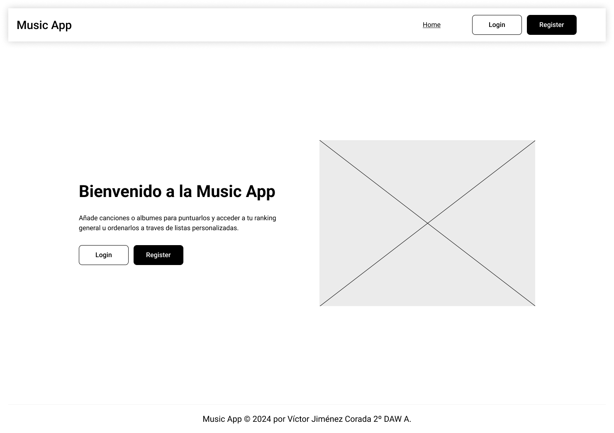
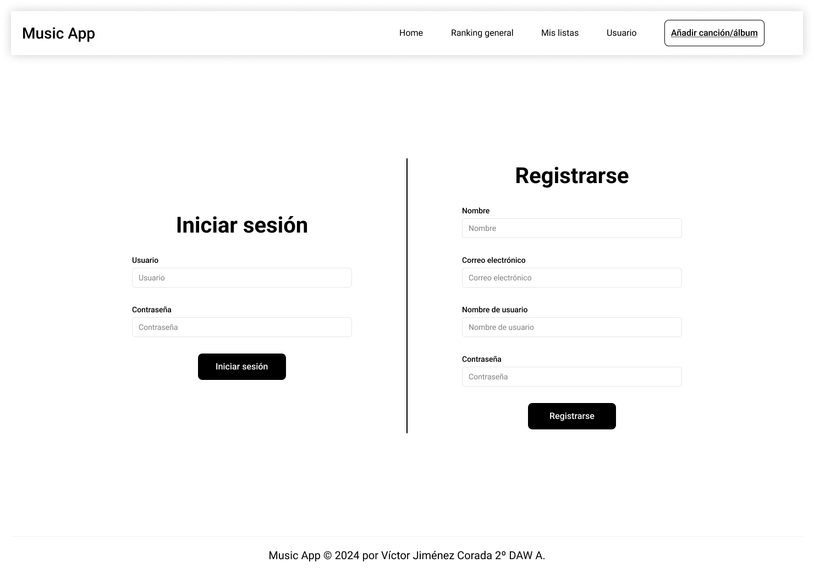
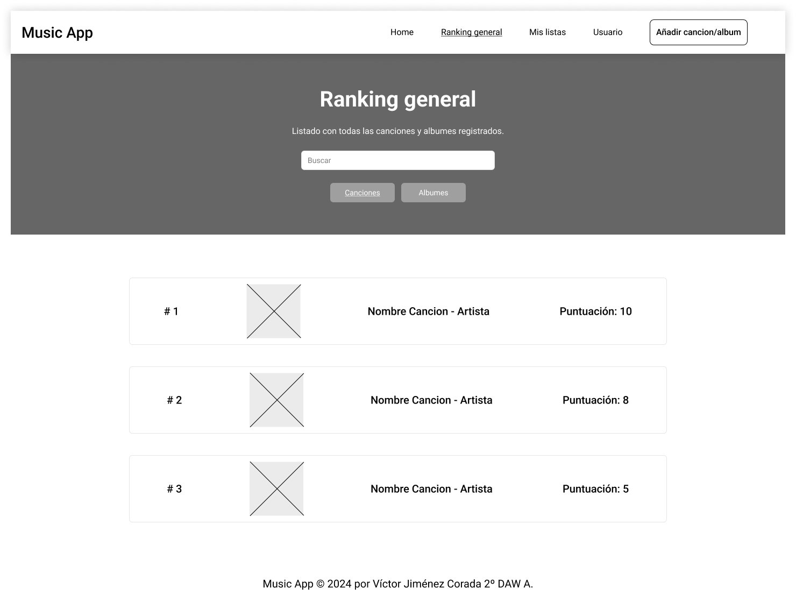
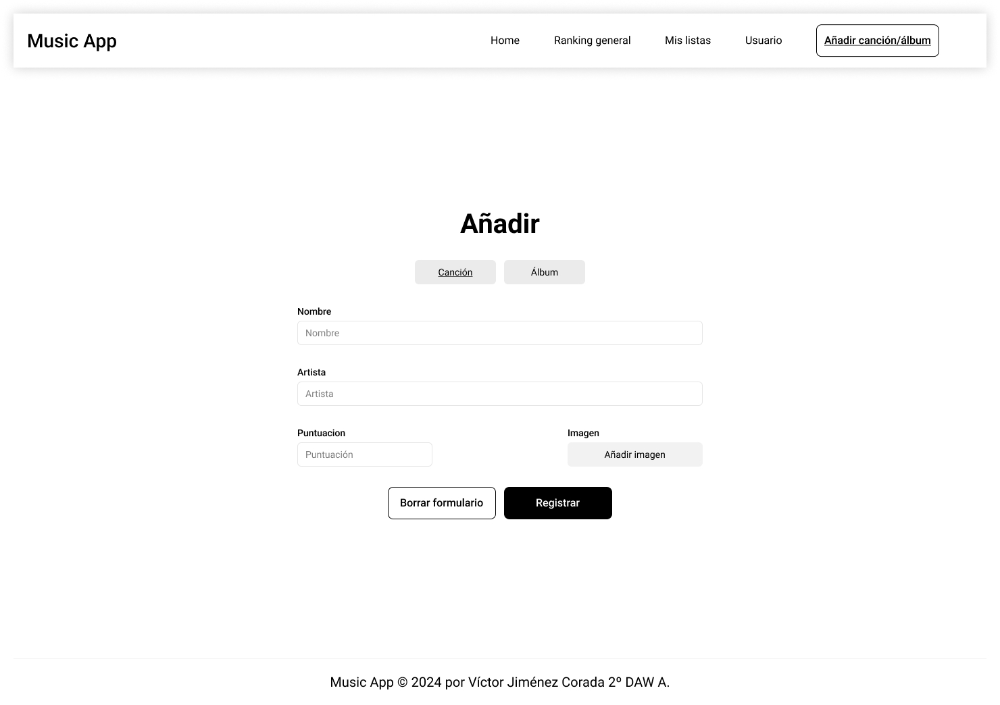

<p align="center">
  <a href="https://vuejs.org" target="_blank"></a>
</p>

# Proyecto 6

#### Proyecto desarrollado por Víctor Jiménez Corada 2º DAW A.

## Índice de contenido

   1. [Introducción](#1-introducción)
   2. [Descripción](#2-descripción)
   3. [Instalación y preparación](#3-instalación-y-preparación)
   4. [Guía de estilos y prototipado](#4-guía-de-estilos-y-prototipado)
   5. [Desarrollo](#5-desarrollo)
   6. [Despliegue](#6-despliegue)
   7. [Manual](#7-manual)
   8. [Conclusiones](#8-conclusiones)
   9. [Índice de tablas e imágenes](#9-índice-de-tablas-e-imágenes)
   10. [Bibliografía y referencias](#10-bibliografía-y-referencias)

## 1. Introducción

La idea inicial era una aplicación web enfocada en la música, donde los usuarios pudieran puntuar y organizar las canciones y álbumes de sus artistas favoritos. Durante el desarrollo ha sido necesario omitir algunas funcionalidades debido a la falta de tiempo, a pesar de ello, se han logrado la mayoría de ellas.

Las tecnologías a utilizar han sido las siguientes:
- Front-end: Vue.js
- Back-end: Laravel
- BBDD: MySQL
- Despliegue: Docker
- Control de versiones: Git

Esta ha sido mi primera experiencia haciendo uso de Vue.js y Laravel, a la vez que desarrollé simultáneamente Front-end y Back-end desde cero.

## 2. Descripción

El resultado obtenido es una aplicación funcional en la que al iniciar sesión pueden añadirse canciones y álbumes y puntuales para posteriormente verlos reflejados en una lista ordenada de todos los elementos añadidos por el usuario. Al añadir un elemento existe persistencia en la base de datos, por lo que la información se mantiene al acceder desde distintos dispositivos. Todos los formularios tanto los de registro e inicio de sesión como el de añadir elementos están validados correctamente inhabilitando los botones si no están correctamente rellenados.

La organizacion del proyecto ha sido dificil ya que al ser la primera experiencia desarrollando Front-end y Back-end simultaneamente, el hecho de aprender Laravel durante el desarrollo ha retrasado el desarrollo del Front-end debido a que no tenia datos con los que empezar a desarrollarlo, a pesar de ello creo que he sabido solventar los problemas que se iban presentando con soltura lo que ha resultado en una aplicacion que es correctamente funcional.

## 3. Instalación y preparación

Para hacer funcionar el proyecto es necesario clonar los dos repositorios referentes al [Front-end](https://github.com/vjimcor955/proyecto_6-backend.git) y [Back-end](https://github.com/vjimcor955/proyecto_6-backend.git)

Las instrucciones para poner el Back-end en funcionamiento se encuentran en el README.md de su repositorio, las instrucciones para poner en funcionamiento el Front-end son las siguientes:

#### 1. Comprobar que Nodejs está instalado con el siguiente comando:

```
node -v
```

En caso de no estar instalado habrá que descargar e instalar la última versión estable de la página web de [Nodejs](https://nodejs.org/en).

#### 2. Abrir el proyecto y ejecutar los siguientes comandos:

Para instalar las herramientas y dependencias usaremos el siguiente comando:
```
npm install
```

Para compilar la aplicación para desarrollo usaremos:
```
npm run dev
```

Para compilarla para producción usaremos:
```
npm run build
```

## 4. Guía de estilos y prototipado

La guía de estilos empleada en este proyecto es la siguiente:

- Paleta de colores:

  La paleta de colores empleada es la siguiente:

  - **Blanco**: #fff
  - **Negro**: #000
  - **Amarillo**: #ffa50080
  - **Naranja**: #ffa500
  - **Azul**: #87cefa80
  - **Azul oscuro**: #1e90ff

- Tipografía:

  La tipografía empleada ha sido la fuente [Afacad](https://fonts.google.com/specimen/Afacad).

- Mockups:

  
  <sub>Imagen 1.</sub>
 
  
  <sub>Imagen 2.</sub>
 
  
  <sub>Imagen 3.</sub>
 
  
  <sub>Imagen 4.</sub>

## 5. Desarrollo

El desarrollo comenzó con la creación del proyecto de Vue.js para el Front-end, creando y enrutando las vistas para posteriormente solo tener que rellenar con el contenido de cada una poco a poco.

Continúe con la creación y configuración del proyecto de Laravel para el Back-end, lo que me tomó más tiempo del que en un principio tenía pensado, ya que era la primera vez que creaba uno y tuve varios problemas con la creación del proyecto.

Durante el resto de desarrollo traté de avanzar simultáneamente en ambas partes del proyecto, lo que resultó en problemas para desarrollar el Front-end debido a la falta de datos. La decisión tomada para resolver este problema fue crear un archivo que contuviese los datos simulando las llamadas a la api para continuar el desarrollo en Vue a la vez que arreglaba los problemas con Laravel.

## 6. Despliegue

Para desplegar el Front-end he usado la plataforma Netlify, ya la he usado anteriormente ya que es sencillo desplegar un repositorio directamente desde Github.

Enlace al despliegue: https://vjimcor955-proyecto-6.netlify.app/#/

> [!IMPORTANT]  
> Debido a que no ha sido posible desplegar el Back-end la aplicación no funciona desde el despliegue de Netlify.

El Back-end trató de desplegarlo tanto en Render como en Heroku pero no ha sido posible.

## 7. Manual

El recorrido para hacer uso de la aplicación es el siguiente:

1. Deberemos registrarnos e iniciar sesión para hacer uso de la aplicación al completo, para ello deberemos acceder a sus correspondientes formularios a través de los botones disponibles tanto en el *header* como en el *home*. Podemos alternar los formularios de inicio de sesión y registro a través del botón situado en la parte inferior de ambos formularios.

2. Tras iniciar sesión podremos ver la lista con todas las canciones que tengamos registradas situada en el *header* de la aplicación en el apartado **Ranking general**.

3. Para añadir una canción o un álbum a nuestra lista deberemos ir al apartado **Añadir canción/álbum** situado en el *header* de la página.

4. También está disponible en el *header* un apartado de **Contacto** en el que se pueden compartir tanto preguntas como sugerencias.

## 8. Conclusiones

En conclusión ha sido un proyecto muy completo en el que he hecho uso de diferentes tecnologías además de obtener experiencia como desarrollador Full-Stack. El resultado final es bastante fiel a la idea original salvo algunos cambios de diseño que se han ido haciendo durante el desarrollo para mejorar la experiencia de usuario y alguna funcionalidad por falta de tiempo.

Como mejoras futuras estarían terminar las funcionalidades planteadas en la idea original y mejorar la organización de la estructura del proyecto.

## 9. Índice de tablas e imágenes.

Índice referente a las imágenes de la documentación:
  - Imagen 1: Imagen que muestra el Mockup de la vista de **Home**.
  - Imagen 2: Imagen que muestra el Mockup de la vista de **Inicio de sesión** y **Registro**.
  - Imagen 3: Imagen que muestra el Mockup de la vista de **Ranking general**.
  - Imagen 4: Imagen que muestra el Mockup de la vista de **Añadir canción/álbum**.

## 10. Bibliografía y referencias.

- [Documentación de Vue.js](https://vuejs.org/guide/introduction.html)
- [Documentación de Laravel](https://laravel.com/docs/10.x/readme)

<br>

#### Proyecto desarrollado por Víctor Jiménez Corada 2º DAW A.